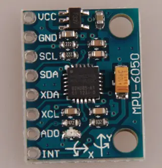
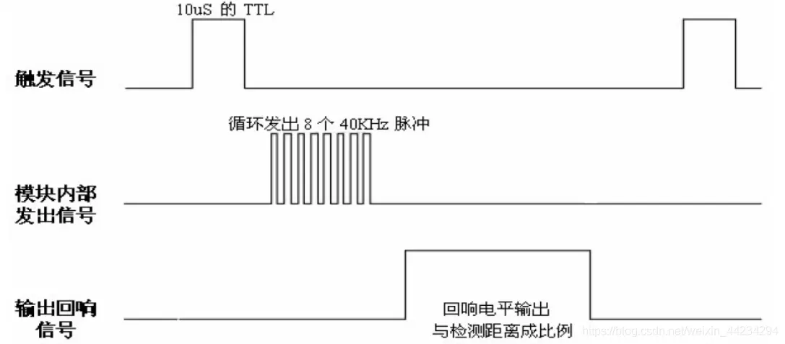

# 1 创建工程

使用 STM32CubeMx 创建 STM32F103C8T6 HAL 库工程, 配置时钟树最大时钟频率 72Mhz

分配 IO 资源, 如下所示

| IO 编号    | 外设     |
| ---------- | -------- |
| PA4        | LED 灯   |
| PA5        | 用户按键 |
| PA9, PA10  | 串口     |
| PA13, PA14 | SWD 接口 |

配置串口参数: 波特率 115200, 数据位 8, 停止位 1, 无校验, 暂不开启中断

## 1.1 添加文件夹和辅助文件

* 添加 build.sh 脚本文件, 用来编译下载 (使用 openocd)
* 添加 .gitignore 文件, 忽略某些文件的 git 版本管理
* 添加 STM32F103.svd 文件, 用来调试时查看寄存器的值
* 添加 .clang-format 文件, 统一文件格式化规范
* 添加 clang-format.py 脚本文件, 使用 clang-format 批量格式化指定文件夹下的源文件
* 添加 .vscode 文件夹, 在此文件夹下创建 launch.json, tasks.json, settings.json

ctrl+shift+p 打开命令搜索窗口, 配置 C/C++ 插件, 在 .vscode 文件夹下新增 c_cpp_properties.json 文件

> 使用  C/C++ 补全, 因为 clangd 对宏的补全不完美, 并且对 doxygen 注释显示的很差劲

## 1.2 串口重定向

> 串口重定向无法打印小数, 所以需要写一个小数转字符串的辅助函数

# 2 编写外设驱动

led 驱动, oled 驱动, mpu6050 驱动

## 2.1 oled 驱动编写

驱动 IC: SSD1306, 屏幕分辨率 128*64, 通信方式: 3 线 SPI

IO 资源分配:

| IO 编号 | oled 引脚名称 |
| ------- | ------------- |
| PA15    | DC            |
| PB3     | RST           |
| PB4     | SDA           |
| PB5     | SCL           |

## 2.2 MPU6050 驱动编写

通信方式: IIC (STM32CubeMx 配置)

IO 资源分配

| IO 编号 | MPU6050 引脚名称 |
| ------- | ---------------- |
| PB8     | SCL              |
| PB9     | SDA              |
| PA12    | INT              |

## 2.3 超声波模块驱动

HC-SR04

IO 资源分配

| IO 编号 | 引脚名称         | 功能配置                     |
| ------- | ---------------- | ---------------------------- |
| PB1     | Trigger (发送端) | 普通IO, 推挽输出             |
| PB0     | Capture (接收端) | TIM3_CH3, 输入采集, 脉宽测量 |

使用通用定时器输入捕获功能, 测量高电平脉宽

**MCU 引脚工作模式配置:** PB1 配置为推挽输出, PB0 配置为复用功能: 定时器输入捕获
(1) PB1 发送一个至少 10us 的高电平, 以此触发超声波测距模块开始工作
(2) 模块自动发送 8 个 40khz 的方波, 然后进入检测状态
(3) 当检测到信号返回, Echo 引脚从低电平 -> 高电平, 通过 PB0 传到 MCU, 高电平持续的时间就是超声波从发射到返回的时间, $测试距离=(高电平时间*声速 (340m/s))/2$

# 3 编码器采集

电机转动的时候, 霍尔元件会根据不同的转动速度产生不同频率的脉冲, 脉冲频率反应了电机转速, 通过定时器输入捕获通道进行脉冲计数, 便可计算编码器产生的脉冲频率

左轮电机的 A 相, B 相输出连接 STM32 的 PA0, PA1 引脚, 右轮电机的 A 相, B 相输出连接 STM32 的 PB6, PB7 引脚

IO 资源分配

| 引脚     | 功能配置                      | 说明                   |
| -------- | ----------------------------- | ---------------------- |
| PA0, PA1 | TIM2_CH1,  TIM2_CH2 输入捕获 | 采集左轮编码器输出数据 |
| PB6, PB7 | TIM4_CH1, TIM4_CH2 输入捕获   | 采集右轮编码器输出数据 |

# 4 电机控制

IO 资源分配

| 引脚       | 功能配置          | 说明             |
| ---------- | ----------------- | ---------------- |
| PA11       | TIM1_CH4 PWM输出  | 控制左轮电机转速 |
| PB12, PB13 | 控制转向          | 控制左轮电机转向 |
| PA8        | TIM1_CH1 PWM 输出 | 控制右轮电机转速 |
| PB14, PB15 | 控制转向          | 控制右轮电机转向 |
